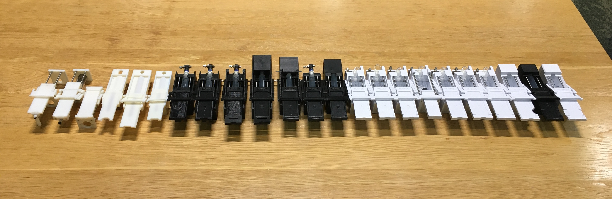

# Inkwell
An electricity-free blood-smearing device

The CAD files for the latest version of Inkwell can be found under the Inkwell_v*** folder in the parent directory. All parts should be printed on an FDM machine without support material and oriented as shown in the accompanying screenshots.